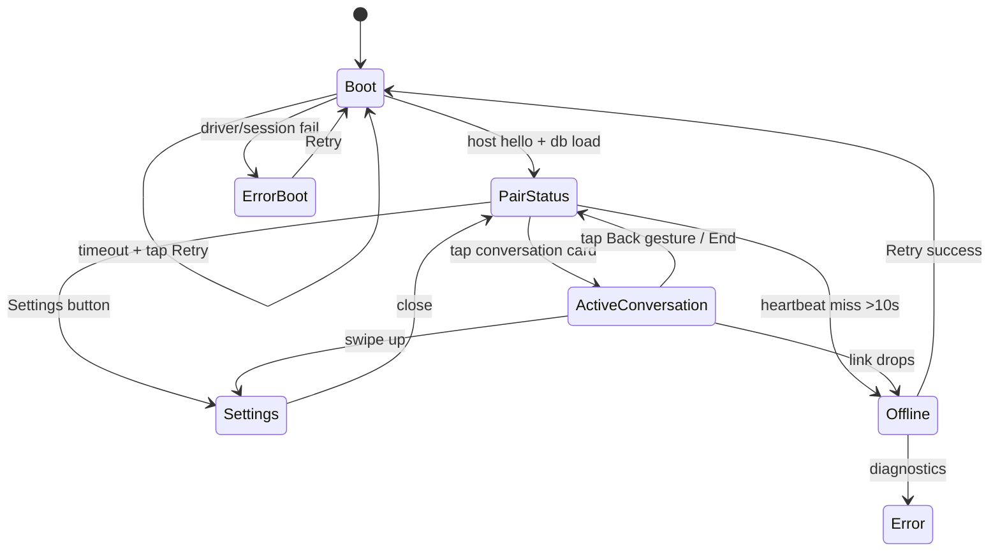

# MicroClaw Device UI Mockups (360x360 Round)

This document provides interaction mockups for the first-pass microClaw UI.

- Canvas target: 360×360px.
- Safe circular viewport: use ~320px diameter for primary content.
- Touch target minimum: 48x48px, recommended 56x56px.

## Screen 1 — Boot / Splash

```
╭───────────────────────────────╮
│ microClaw                    │
│                               │
│                               │
│       ●●●  microClaw         │
│      ●       ●  Booting      │
│     ●    •    ●  host stack   │
│      ●       ●               │
│       ●●●●●                    │
│                               │
│    Loading secure session...   │
│    Connecting transport...     │
│                               │
│        [ Retry ]              │
│                               │
╰───────────────────────────────╯
```

Touch:
- `Retry` -> re-run boot and transport sequence.

---

## Screen 2 — Paired / Device status

```
╭───────────────────────────────╮
│ 9:41  Wi‑Fi ●  Host ●       │
│                               │
│  Paired Device: microClaw-01   │
│  Host: microclaw-host.local    │
│  Connection: Good (rtt 34ms)   │
│                               │
│  Last Sync: 2m ago            │
│                               │
│  ┌─────────────────────────┐   │
│  │ Active Conversation      │   │
│  │ Start talking anytime   │   │
│  └─────────────────────────┘   │
│                               │
│  ┌───────┐   ┌───────────────┐ │
│  │Unpair │   │Sync Now      │ │
│  └───────┘   └───────────────┘ │
│                               │
│        [ Pairing / Settings ]  │
╰───────────────────────────────╯
```

Touch:
- Large middle card enters conversation mode.
- Secondary row: quick actions.

---

## Screen 3 — Active conversation

```
╭───────────────────────────────╮
│ 9:41  Host ●  Battery 82%     │
│                               │
│  ┌─────────────────────────┐  │
│  │ User: “Turn on lights”   │  │
│  └─────────────────────────┘  │
│  ┌─────────────────────────┐  │
│  │ microClaw: “Done.”       │  │
│  └─────────────────────────┘  │
│  Typing… ●●●                   │
│                               │
│     [ Mic / PTT ]             │
│                               │
│ [Mute]             [End]      │
│                               │
│   [ Pause / Offline mode ]    │
╰───────────────────────────────╯
```

Touch:
- `Mic/PTT` starts/ends capture.
- `Mute` toggles local output.
- `End` exits active conversation.

---

## Screen 4 — Settings overlay

```
╭───────────────────────────────╮
│ Settings                  ×   │
│───────────────┬───────────────│
│  [Wi‑Fi]      [Audio]      │
│  status       status         │
│                               │
│  [Host]       [Security]    │
│  endpoint     allowlist       │
│                               │
│  [Logs]       [OTA]         │
│  tail         update         │
│                               │
│  [Reset]                      │
╰───────────────────────────────╯
```

---

## Screen 5 — Error / Offline

```
╭───────────────────────────────╮
│ ⚠  Connection Offline         │
│                               │
│  No heartbeat in 30s.         │
│  Host: microclaw-host.local    │
│  Last attempt: failed TLS      │
│                               │
│  ┌─────────────────────────┐   │
│  │  Retry Connection  │   │   │
│  └─────────────────────────┘   │
│                               │
│  ┌─────────────────────────┐   │
│  │   Restart Device      │   │
│  └─────────────────────────┘   │
│                               │
│  [ View Diagnostics ]         │
╰───────────────────────────────╯
```

---

## Interaction flow


